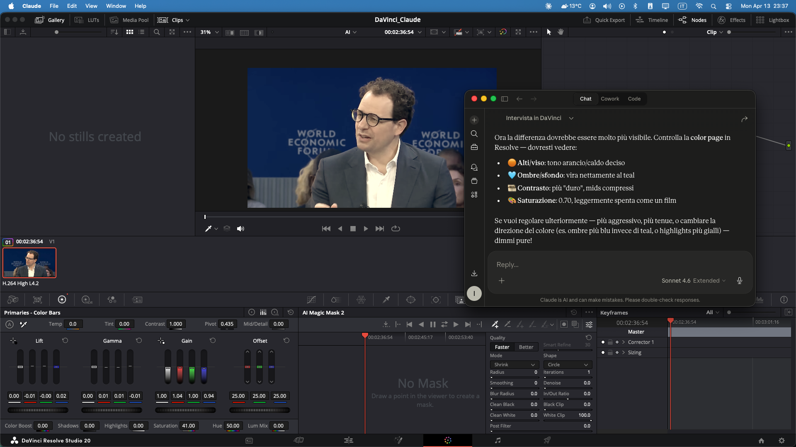
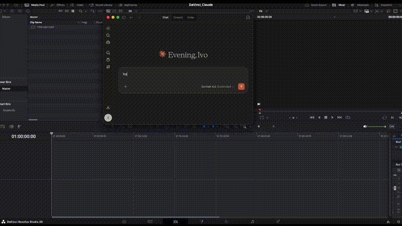
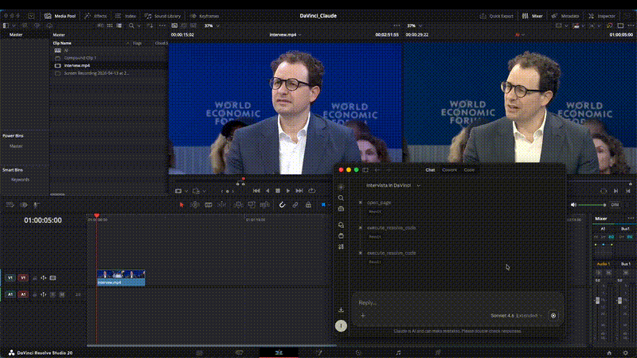

# Resolve Claude MCP

Connect **DaVinci Resolve Studio** to **Claude AI** through the [Model Context Protocol (MCP)](https://modelcontextprotocol.io), enabling AI-assisted video editing, color grading, Fusion compositing, and more — all through natural language.

> **Note:** This is a third-party integration and is not created by or affiliated with Blackmagic Design.
>
> ⚠️ **Use at your own risk.** This project is intended for testing and experimentation. **Do not use in production.** AI-assisted tools can modify or delete your project data — always work on backups.

> **Platform support:** Tested only on **macOS** (Apple Silicon). The Blackmagic scripting API is cross-platform, so the core 48 Resolve-control tools may work on Windows and Linux as well, but this is unverified. The local transcription tools and the `screenshot` tool are **macOS-only** (they rely on `mlx-whisper` and macOS-specific screen-capture APIs).

## Demo

<p align="center">
  
</p>

### Color Grading with Claude



### Local Transcription & Subtitles



## Features

### Core
- Direct connection to DaVinci Resolve Studio's scripting API — no addon or plugin needed inside Resolve
- Project inspection and navigation across all pages (Media, Cut, Edit, Fusion, Color, Fairlight, Deliver)
- Media pool management (import, organize, browse)
- Timeline creation and editing
- Arbitrary Python code execution with the full Resolve API

### Color Grading
- Node graph inspection and manipulation
- LUT application
- CDL (Color Decision List) adjustments

### Fusion (Compositing / VFX)
- Create, import, export, and manage Fusion compositions
- Insert Fusion generators, titles, and blank compositions
- Merge timeline items into Fusion clips

### AI / DaVinci Neural Engine
- **Magic Mask** — AI-powered subject isolation
- **Smart Reframe** — automatic reframing for different aspect ratios
- **Stabilization** — AI-powered clip stabilization
- **Scene Cut Detection** — auto-detect and cut at scene boundaries
- **Subtitle Generation** — AI speech-to-text with multi-language support
- **Voice Isolation** — separate speech from background noise

### Local Transcription (macOS / Apple Silicon only)
- **mlx-whisper** transcription running locally on your Mac's Neural Engine / GPU
- Auto-chunks long files with ffmpeg (5-min pieces) — no timeouts on hour-long clips
- Returns compact timestamped transcript inline for immediate use
- Saves SRT file next to source for Resolve subtitle import
- Multiple model sizes: tiny (fastest) to large (most accurate), default: turbo
- **Windows/Linux users:** these tools are unavailable (MLX is Apple-only). The other 48 tools work fine.

### Screenshot (macOS only)
- `screenshot` — captures the Resolve window so Claude can visually inspect what's on screen
- Uses macOS `screencapture` + Quartz to target the Resolve window directly
- Needs Screen Recording permission for Claude Desktop in System Settings
- **Windows/Linux users:** this tool is unavailable

### Rendering
- Browse available formats and codecs
- Configure render settings
- Queue and start render jobs
- Monitor render progress

### Code Execution
- `execute_resolve_code` — run any Python code with the Resolve API available (`resolve`, `project`, `mediaPool`, `timeline`, `mediaStorage` pre-loaded)
- This is the power tool: anything the Resolve Python API can do, Claude can do

## Architecture

Unlike BlenderMCP which requires a socket-based addon, Resolve Claude MCP connects directly to DaVinci Resolve via its native scripting API. This means a simpler, single-process architecture:

```
Claude AI (MCP Client)
    |
    v
Resolve Claude MCP Server (FastMCP)
    |
    v
DaVinciResolveScript (fusionscript.so)
    |
    v
DaVinci Resolve Studio (running)
```

No addon to install inside Resolve. No socket server. Just one MCP server that talks directly to Resolve.

## Prerequisites

- **DaVinci Resolve Studio** 18.0+ (free version has limited scripting support)
- **Python** 3.10+
- **uv** package manager

Install uv:
```bash
# macOS
brew install uv

# Windows
powershell -ExecutionPolicy ByPass -c "irm https://astral.sh/uv/install.ps1 | iex"

# Linux
curl -LsSf https://astral.sh/uv/install.sh | sh
```

## Installation

### Step 1: Clone this repo

```bash
git clone https://github.com/barckley75/resolve-claude-mcp.git
cd resolve-claude-mcp
uv sync
```

Note the **absolute path** to the folder you just cloned — you'll need it in Step 2.

### Step 2: Tell Claude Desktop about this server

Claude Desktop has a settings file called **`claude_desktop_config.json`** that lists every MCP server it should launch on startup. You need to add an entry to that file so Claude Desktop knows about Resolve Claude MCP.

The file lives in your **user folder** (not inside the Claude app):

- **macOS:** `~/Library/Application Support/Claude/claude_desktop_config.json`
- **Windows:** `%APPDATA%\Claude\claude_desktop_config.json`

Open it (or create it if it doesn't exist — these commands will create a blank file you can fill in):

```bash
# macOS — opens in TextEdit
open -e "$HOME/Library/Application Support/Claude/claude_desktop_config.json"

# Windows (PowerShell) — opens in Notepad
notepad "$env:APPDATA\Claude\claude_desktop_config.json"
```

When the editor opens, paste in the JSON below. Replace `/absolute/path/to/resolve-claude-mcp` with the path to the folder you cloned in Step 1. If the file already has other MCP servers in it, just add the `"resolve"` block inside the existing `"mcpServers"` object — don't create a second `"mcpServers"`.

```json
{
  "mcpServers": {
    "resolve": {
      "command": "uv",
      "args": [
        "--directory",
        "/absolute/path/to/resolve-claude-mcp",
        "run",
        "resolve-claude-mcp"
      ],
      "env": {
        "RESOLVE_SCRIPT_LIB": "/Applications/DaVinci Resolve/DaVinci Resolve.app/Contents/Libraries/Fusion/fusionscript.so",
        "RESOLVE_SCRIPT_API": "/Library/Application Support/Blackmagic Design/DaVinci Resolve/Developer/Scripting",
        "PYTHONPATH": "/Library/Application Support/Blackmagic Design/DaVinci Resolve/Developer/Scripting/Modules/"
      }
    }
  }
}
```

> If `uv` isn't on Claude Desktop's `PATH`, use the full path — find it with `which uv` (macOS/Linux) or `where.exe uv` (Windows). On macOS via Homebrew it's typically `/opt/homebrew/bin/uv`.

<details>
<summary>Windows environment variables</summary>

```json
{
  "mcpServers": {
    "resolve": {
      "command": "uv",
      "args": [
        "--directory",
        "C:\\absolute\\path\\to\\resolve-claude-mcp",
        "run",
        "resolve-claude-mcp"
      ],
      "env": {
        "RESOLVE_SCRIPT_LIB": "C:\\Program Files\\Blackmagic Design\\DaVinci Resolve\\fusionscript.dll",
        "RESOLVE_SCRIPT_API": "C:\\ProgramData\\Blackmagic Design\\DaVinci Resolve\\Support\\Developer\\Scripting",
        "PYTHONPATH": "C:\\ProgramData\\Blackmagic Design\\DaVinci Resolve\\Support\\Developer\\Scripting\\Modules\\"
      }
    }
  }
}
```

If you installed Resolve on a non-default drive (e.g. `D:\`), update `RESOLVE_SCRIPT_LIB` to point at the actual location of `fusionscript.dll`. The `RESOLVE_SCRIPT_API` / `PYTHONPATH` paths stay under `C:\ProgramData\` regardless of where Resolve itself was installed.

</details>

<details>
<summary>Linux environment variables</summary>

```json
{
  "mcpServers": {
    "resolve": {
      "command": "uv",
      "args": [
        "--directory",
        "/absolute/path/to/resolve-claude-mcp",
        "run",
        "resolve-claude-mcp"
      ],
      "env": {
        "RESOLVE_SCRIPT_LIB": "/opt/resolve/libs/Fusion/fusionscript.so",
        "RESOLVE_SCRIPT_API": "/opt/resolve/Developer/Scripting",
        "PYTHONPATH": "/opt/resolve/Developer/Scripting/Modules/"
      }
    }
  }
}
```

</details>

### Step 3: Enable Scripting in Resolve

1. Open DaVinci Resolve Studio
2. Go to **Preferences > General**
3. Under **External scripting using**, select **Local** (or **Network** if running remotely)

### Step 4: Restart Claude Desktop

Quit and reopen the Claude Desktop app. You should see the Resolve Claude MCP tools available (hammer icon).

## Usage

Make sure DaVinci Resolve Studio is running with a project open, then talk to Claude:

### Project & Navigation
> "What project do I have open?"  
> "Switch to the Color page"  
> "How many timelines are in this project?"

### Media & Timeline
> "Import all the .mp4 files from ~/Videos/project/ into the media pool"  
> "Create a new timeline called 'Rough Cut'"  
> "What clips are on video track 1?"  
> "Add a red marker at frame 200 called 'Fix audio here'"

### Color Grading
> "Show me the node graph for the first clip"  
> "Apply this LUT to node 1: /path/to/my.cube"  
> "Set CDL values: increase slope to 1.2 and reduce saturation to 0.8"

### AI Features
> "Run scene cut detection on the timeline"  
> "Apply Smart Reframe to the first clip"  
> "Create a Magic Mask on clip 3 to isolate the subject"  
> "Generate subtitles from the audio in English"  
> "Enable Voice Isolation on audio track 1"  
> "Stabilize the second clip on video track 1"

### Transcription
> "Transcribe ~/Videos/interview.mp4"  
> "Transcribe this clip in French using the large model"  
> "Export an SRT file from ~/Videos/podcast.wav to ~/Desktop/podcast.srt"  
> "Transcribe the audio and add subtitle markers to the timeline"

### Fusion
> "List all Fusion compositions on the first clip"  
> "Add a Fusion composition to clip 2"  
> "Insert a Fusion title into the timeline"

### Rendering
> "What render formats are available?"  
> "Set up a render to ProRes 422 HQ, output to ~/Desktop/exports"  
> "Add a render job and start rendering"  
> "What's the render progress?"

### Power Tool
> "Run this code: print(project.GetSetting('timelineFrameRate'))"

## Available Tools (52)

| Category | Tools |
|---|---|
| **Project & Navigation** | `get_project_info`, `open_page`, `get_current_page` |
| **Media Pool** | `get_media_pool_structure`, `import_media`, `create_timeline` |
| **Timeline** | `get_current_timeline_info`, `get_timeline_items`, `append_to_timeline`, `add_marker`, `get_markers`, `set_current_timecode`, `get_current_timecode` |
| **Item Properties** | `get_timeline_item_properties`, `set_timeline_item_property` |
| **Color Grading** | `get_node_graph`, `set_lut`, `set_cdl` |
| **Rendering** | `get_render_formats`, `get_render_settings`, `set_render_settings`, `add_render_job`, `start_rendering`, `get_render_status`, `stop_rendering` |
| **AI / Neural Engine** | `create_magic_mask`, `regenerate_magic_mask`, `smart_reframe`, `stabilize`, `detect_scene_cuts`, `create_subtitles_from_audio` |
| **Audio** | `get_voice_isolation_state`, `set_voice_isolation_state` |
| **Fusion** | `get_fusion_comp_list`, `add_fusion_comp`, `import_fusion_comp`, `export_fusion_comp`, `load_fusion_comp`, `delete_fusion_comp`, `rename_fusion_comp`, `create_fusion_clip`, `insert_fusion_generator`, `insert_fusion_composition`, `insert_fusion_title` |
| **Export** | `export_timeline`, `export_current_frame` |
| **Thumbnail** | `get_current_thumbnail` |
| **Local Transcription** _(macOS only)_ | `transcribe_audio`, `transcribe_and_add_subtitles`, `export_srt`, `list_whisper_models` |
| **Screenshot** _(macOS only)_ | `screenshot` |
| **Code Execution** | `execute_resolve_code` |

## Troubleshooting

### "Could not connect to DaVinci Resolve"
- Make sure DaVinci Resolve Studio is running
- Check that scripting is enabled in **Preferences > General > External scripting using**
- Verify the `RESOLVE_SCRIPT_LIB` path matches your installation

### "Failed to import DaVinciResolveScript"
- Check that `PYTHONPATH` in the config points to the correct Modules directory
- On macOS, the default path is `/Library/Application Support/Blackmagic Design/DaVinci Resolve/Developer/Scripting/Modules/`

### "No active timeline"
- Open a project and make sure a timeline is loaded before using timeline tools

### Tools not appearing in Claude Desktop
- Make sure `uv` is installed: `uv --version`
- Restart Claude Desktop after editing `claude_desktop_config.json`
- Check the Claude Desktop logs for MCP server errors

## Important Notes

- **DaVinci Resolve Studio** is required for full scripting API access. The free version has limited scripting support.
- `execute_resolve_code` runs arbitrary Python — review code before executing.
- Some tools require being on a specific page (e.g., thumbnails require the Color page).
- The server connects to whichever project is currently open — switching projects in Resolve is reflected immediately.

## Disclaimer

**USE AT YOUR OWN RISK.** This software is provided "as is", without warranty of any kind, express or implied. By using Resolve Claude MCP you acknowledge and accept that:

- This is an **unofficial, third-party project** — not created by, affiliated with, endorsed by, or supported by Blackmagic Design or Anthropic.
- It is designed to control DaVinci Resolve Studio through an AI assistant. AI agents can make mistakes: they may **modify, overwrite, or delete** your projects, timelines, clips, render queues, or files on disk.
- The `execute_resolve_code` tool executes **arbitrary Python code** with full access to the Resolve API and your filesystem. Inspect code before allowing execution.
- The `screenshot` tool captures the DaVinci Resolve window (or the full screen as a fallback). **These images are sent to the AI provider** (Anthropic) for analysis. Anything visible in the screenshot — client footage, unreleased material, personal content, notifications, passwords, other apps in the background — may be transmitted. Only use it when you're comfortable with what's on screen, and be aware of your NDAs and privacy obligations.
- **Always work on a backup of your project.** Save often. Use Resolve's built-in project backups (Project Manager → right-click → Backups). Keep media outside the project folder if it matters to you.
- The authors and contributors accept **no liability** for lost work, corrupted projects, missed deadlines, wasted render time, accidental uploads/exports, API charges, or any other damages arising from use of this software.
- You are responsible for reviewing what the AI is about to do before approving tool calls in your MCP client.

If this is production work on a client project, don't let the AI drive unsupervised. Watch the tool calls, keep backups, render proofs.

## License

MIT — see [LICENSE](LICENSE). The MIT license specifically disclaims all warranties and liability; the Disclaimer section above restates that in plain English.

## Acknowledgments

Inspired by [BlenderMCP](https://github.com/ahujasid/blender-mcp) by Siddharth Ahuja.  
Built with the [Model Context Protocol](https://modelcontextprotocol.io) by Anthropic.
